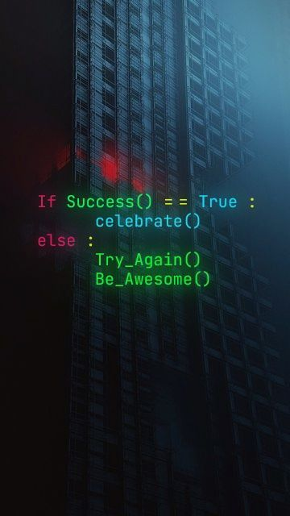

# HossyKh

<!DOCTYPE html>
<html lang="en">
<head>
    <title>Hossein Khosravi</title>
    
</head>
<body>
    <h1>Welcome to Hossy's Website</h1>
    
In this web you can find some information about me.

    <nav>
        <a href="index.html">Home</a>
        <a href="ability_knowledge.html">Ability & Knowledge</a> 
        <a href="favorites.html">Favorites</a>
        <a href="links.html">Links</a>
    </nav>

    

        <h2>About Me</h2>
        
I'm Hossein Khosravi, a CS student at Yazd University. I am a smart and active student in computer science and a big fan of the English language.  
        So, I engage in various activities to showcase my skills and interests in these fields.

        
        
    

</body>
</html>

<!DOCTYPE html>
<html lang="en">
<head>
    <title>My Skills and Knowledge - Hossein Khosravi</title>
    
</head>
<body>
    <h1>My Skills and Knowledge</h1>
    <nav>
        <a href="index.html">Home</a>
        <a href="ability_knowledge.html">Ability & Knowledge</a> 
        <a href="favorite.html">Favorite</a>
        <a href="links.html">Links</a>
    </nav>

    

        
First of all, I have to say that I am good at English because I have studied the language and participated in different classes for many years, around 8 or 9 years. Then, I took part in the IELTS exam and achieved a score of 7. I am glad to be able to speak and write in two languages.  

        In addition, I know programming to some extent, specifically in Python and C++. I have worked for a company where I developed a project by using Python. Additionally, I use C++ for my university studies and projects.  

        In a nutshell, I am exploring different ways to improve and demonstrate my skills.

        
    

</body>
</html>
